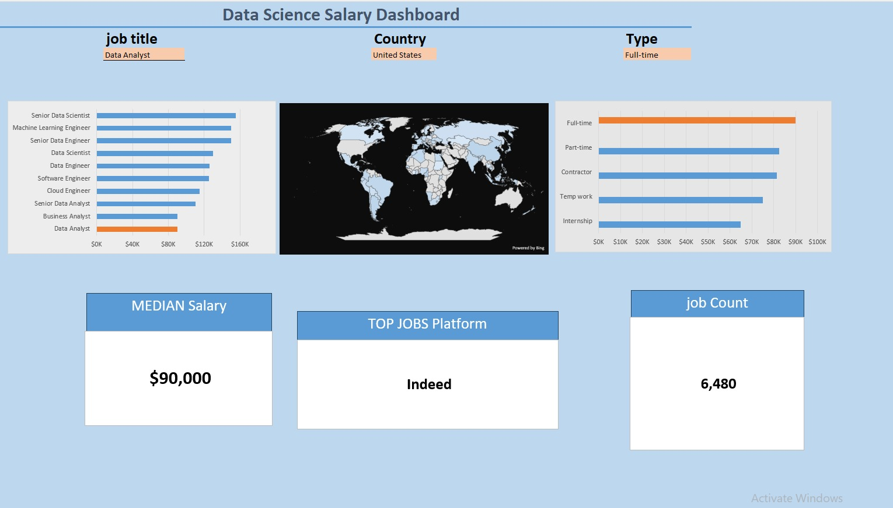

# Data Science Salary Dashboard

An interactive **Excel dashboard** that analyze Data Science job salaries across different job titles, countries, and employment types.

## 📊 Dashboard Overview

The dashboard allows users to dynamically explore the data using interactive filters and discover key insights about Data Science salaries and job opportunities.

### 🔍 Key Insights

* **Median Salary by Job Title**
* **Salary Distribution by Employment Type**
* **Median Salary Distribution by Country** using a world map
* **Top Job Platforms** for Data Science roles
* **Total Job Count** based on selected filters

## 🛠️ Tools Used

* Microsoft Excel
* Power Query
* Pivot Tables
* Data Validation
* Excel Charts
* Bing Maps

## 🎯 Project Goal

The goal of this project is to provide an interactive way to explore salary trends in the Data Science job market and identify differences across job titles, countries, and employment types.

## 📷 Dashboard Preview

## 📁 Project Files

* `Data Science Salary Dashboard.xlsx` — Interactive Excel dashboard
* `README.md` — Project documentation
